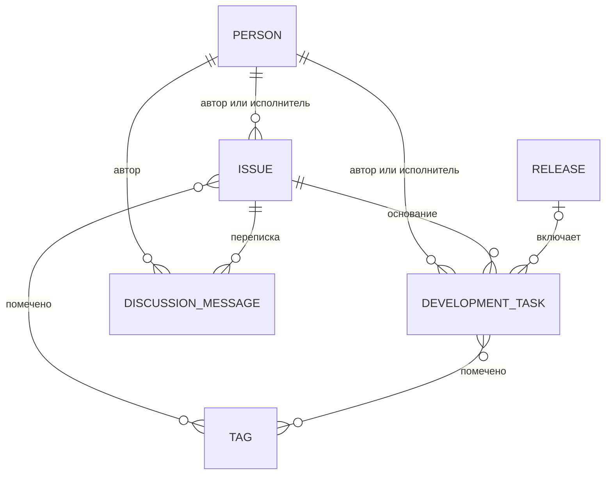

# Предметная модель

## 1. Основная модель



Центр модели — обращение. Оно одновременно является входящим запросом и, при типе «ТЗ», контейнером крупного блока требований. Задача всегда подчинена одному обращению.

## 2. Обращение как группировка

Отдельная сущность «Инициатива» не вводится. Это сознательное упрощение:

- одиночная ошибка регистрируется как обращение «Ошибка» и может породить одну задачу;
- идея регистрируется как обращение «Идея» и может оставаться в backlog без задач;
- готовый конкретный запрос регистрируется как «Предложение»;
- крупный документ регистрируется как обращение «ТЗ» и порождает несколько задач;
- вопрос может быть закрыт ответом без создания задачи.

Ограничение модели: одна задача не может объединять требования из нескольких обращений. Если это понадобится в будущем, потребуется отдельная сущность группировки или таблица связей, но для MVP такое усложнение не требуется.

## 3. Кардинальности и обязательность

| Связь | Правило |
|---|---|
| Обращение → задача | Ноль или много задач |
| Задача → обращение | Ровно одно обязательное основание |
| Релиз → задача | Ноль или много задач |
| Задача → релиз | Ноль или один релиз |
| Обращение → сообщение | Ноль или много сообщений |
| Сообщение → обращение | Ровно одно обращение |
| Обращение/задача → тег | Ноль или много тегов |
| Автор/исполнитель | Ровно одно физическое лицо в каждом заполненном поле; множественный выбор не поддерживается |

Переписка ведется только по обращению. Обсуждение задачи при необходимости продолжается в исходном обращении, ссылка на которое всегда доступна из задачи.

## 4. Жизненный цикл обращения

```text
Новое → На рассмотрении → Принято → В работе → Выполнено
                      ├→ Отклонено
                      └→ Дубликат
```

Допустимы возвраты на предыдущий рабочий статус, если обращение требует повторного рассмотрения. В MVP переходы не блокируются жестким workflow: пользователь с полными правами выбирает статус вручную.

Рекомендованные правила работы:

- при регистрации устанавливается «Новое»;
- перед решением — «На рассмотрении»;
- после решения о реализации — «Принято»;
- после начала хотя бы одной задачи — «В работе»;
- после завершения требуемых задач — «Выполнено»;
- «Отклонено» и «Дубликат» являются терминальными статусами.

## 5. Жизненный цикл задачи

```text
Запланирована → В работе → На проверке → Выполнена
      └───────────────────────────────→ Отменена
```

Статусы изменяются вручную. Возврат из «На проверке» в «В работе» разрешен. В MVP не требуется проверять переходы программно.

## 6. Жизненный цикл релиза

```text
Планируется → Готовится → Опубликован
```

Фактическая дата публикации обязательна для опубликованного релиза как бизнес-правило. В MVP это правило проверяется пользователем; жесткая программная валидация может быть добавлена позднее.

## 7. Важность, срочность и планирование

Важность используется и у обращения, и у задачи. У задачи это одновременно приоритет выполнения. Отдельное поле приоритета не создается.

Срочность существует только у обращения и отражает требуемую скорость реакции. Таким образом, критически важное, но не срочное изменение отличается от срочной локальной проблемы.

При вводе задачи на основании обращения рекомендуется переносить важность. Исполнитель, плановая дата, оценка и релиз могут быть скорректированы при планировании.

## 8. Правило декомпозиции ТЗ

Используется следующий тест самостоятельности:

- если часть ТЗ может иметь собственные статус, исполнителя, оценку или релиз — это задача;
- если пункт только уточняет ожидаемое поведение одной задачи — это пункт чеклиста;
- если пункт является справочным контекстом или примером — он остается в описании задачи либо обращения.

Пример:

```text
Обращение типа «ТЗ»: Frontend: Базис — UI-правочки
├── Задача: Выезжающее меню разделов сайдбара
│   └── Чеклист: ширина, положение, высота, прокрутка, ellipsis, закрытие
├── Задача: Стили пунктов меню
│   └── Чеклист: общий hover, общий active
└── ... еще 11 задач
```

## 9. Backlog как представление

Backlog не имеет собственного жизненного цикла и не владеет данными.

Рекомендуемые выборки:

| Раздел | Условие |
|---|---|
| Идеи | Тип обращения = «Идея», статус не «Выполнено», «Отклонено» или «Дубликат» |
| Принятые без декомпозиции | Статус обращения = «Принято», дочерних задач нет |
| Задачи вне релиза | Релиз не заполнен, статус задачи не «Выполнена» и не «Отменена» |

Для MVP эти выборки получают фильтрами стандартных списков. Выделенный экран backlog остается возможным расширением.

## 10. Данные и история

- Удаление основных сущностей должно быть логическим, штатными средствами BaSYS.
- Изменения основных сущностей сохраняются стандартной историей метаобъекта.
- Сообщения переписки являются самостоятельными строками регистра и не требуют отдельного журнала изменений.
- Файлы хранятся штатным механизмом вложений операций и не дублируются в сообщениях.
